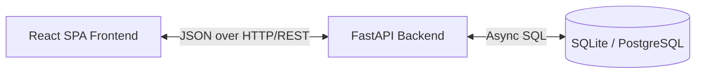

# System Architecture

## High-Level Architecture
ICAP follows a standard decoupled Client-Server architecture, ensuring separation of concerns, scalability, and ease of deployment.

## Backend Architecture (Repository Pattern)
The backend is built with **FastAPI** and structured to separate concerns, making it highly testable and scalable:

1. **Routers (`app/routers/`)**: Handle HTTP requests, validate input via Pydantic schemas, and format API responses.
2. **Dependencies (`app/dependencies/`)**: Handle cross-cutting concerns like JWT validation, session injection, and RBAC checking.
3. **Services (`app/services/`)**: Will contain core business logic in future milestones (e.g., puzzle generation).
4. **Repositories (`app/repositories/`)**: Abstract database operations. Routers call generic repositories rather than querying the database directly.
5. **Models (`app/models/`)**: SQLAlchemy declarative models mapping to relational database tables.

## Frontend Architecture
The frontend is built with **React 19** and **Vite**, utilizing a component-based architecture heavily reliant on React Context and Hooks:

1. **Contexts (`src/contexts/`)**: Provide global state management (e.g., `AuthContext` for user sessions).
2. **Hooks (`src/hooks/`)**: Abstract complex component logic (e.g., `useAsync` for unified API loading/error states).
3. **Services (`src/services/`)**: Centralized Axios client configuration with automated JWT injection and 401 interception.
4. **Layouts (`src/layouts/`)**: Structural components housing navigation and protected routing outlets.
5. **Pages (`src/pages/`)**: Top-level views containing page-specific layout and data fetching logic.
