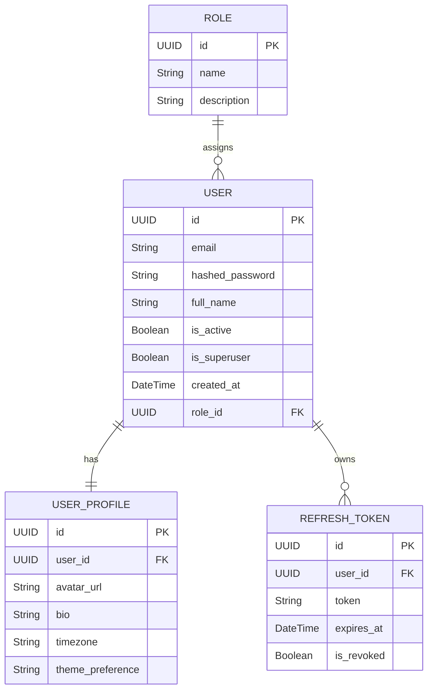

# Database Documentation

The ICAP backend utilizes an asynchronous relational database architecture powered by **SQLAlchemy 2.x**.

## Database Engine
For Milestone 1, the default configuration utilizes **SQLite** with the `aiosqlite` async driver. This ensures a seamless, zero-configuration setup for local development. The ORM is fully compatible with PostgreSQL (`psycopg` async) for future production deployments.

## Entity Relationship Schema

## Schema Definitions

1. **Role (`roles`)**: Defines RBAC permissions (e.g., admin, user, coach).
2. **User (`users`)**: Core authentication entity storing hashed credentials and system flags.
3. **UserProfile (`user_profiles`)**: Extended demographic and preference data separated from the core auth loop for performance.
4. **RefreshToken (`refresh_tokens`)**: Stores generated JWT refresh tokens for secure session persistence and revocation.

## Auto-Seeding
On the first application boot (`lifespan` event), the database will:
1. Auto-generate all required tables.
2. Seed the default roles (`admin`, `user`, `coach`).
3. Seed a default admin user (`admin@icap.dev`).
4. Seed a default demo user (`demo@icap.dev`).
