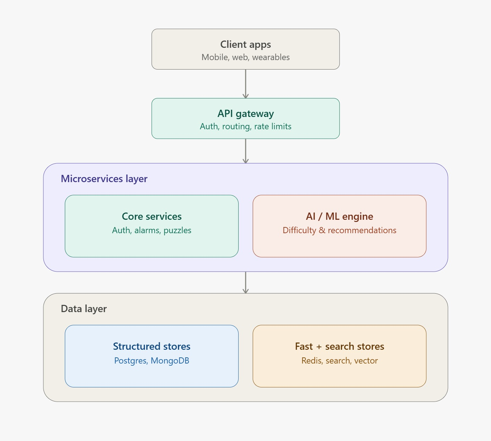
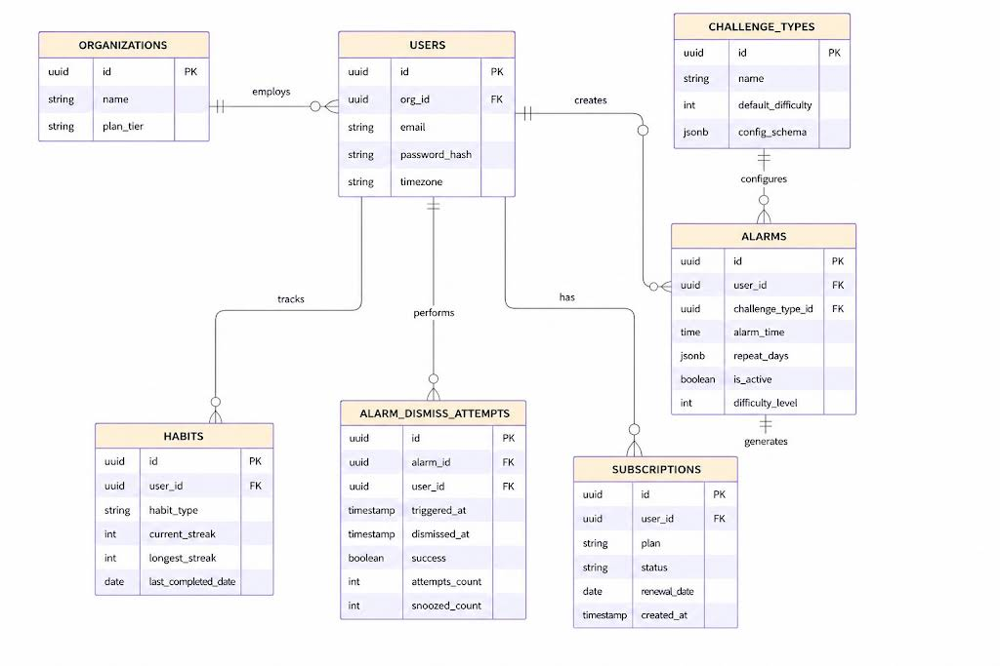

# Intelligent Cognitive Alarm Platform

## Team Member
**Mariya Mallick**

## Branch
**MariyaMallick**

---

# Project Overview

The Intelligent Cognitive Alarm Platform is an AI-powered mobile application that helps users build healthy wake-up habits. Instead of simply dismissing an alarm, users must complete cognitive challenges such as math problems, logic puzzles, memory games, riddles, or pattern recognition tasks.

The system analyzes user performance and behavior to adapt challenge difficulty, reduce snooze habits, and provide personalized recommendations for improving sleep quality and productivity.

---

# My Responsibility (AI/ML)

As the AI/ML developer, my responsibilities include:

- AI Challenge Engine
- Adaptive Difficulty Engine
- Behavior Analysis
- Recommendation Engine
- AI Workflow Design
- Alarm Logic Design
- Alarm Scheduling Design
- System Architecture Design
- Database Schema Design

---

# Progress

## ✅ Week 1

- Designed System Architecture
- Designed Database Schema
- Added HTML Database Schema
- Created AI Module Structure
- Planned AI Workflow
- Initialized AI Project Structure

## ✅ Week 2

- Designed Alarm Logic
- Designed Alarm Scheduling Workflow
- Implemented AI Challenge Engine
- Added Challenge Model
- Added Sample Dataset
- Created AI Testing Module
- Developed Main AI Workflow
- Updated AI Documentation

---

## ✅ Week 3

### AI Challenge Engine Enhancement

Implemented support for:

#### Challenge Types

- Math Challenges
- Memory Challenges
- Logic Challenges

#### Difficulty Levels

- Easy
- Medium
- Hard

#### Features

- Dynamic Challenge Generation
- Challenge Type Selection
- Difficulty Selection
- Random Challenge Generation
- User Input Validation
- Answer Validation
- Interactive Console Testing

Successfully tested all challenge types across Easy, Medium, and Hard difficulty levels.

---

# Folder Structure

```text
Cognitive-Alarm-System/
│
├── ai/
│   ├── challenge_engine.py
│   ├── adaptive_engine.py
│   ├── behavior_analysis.py
│   ├── recommendation_engine.py
│   ├── models.py
│   ├── sample_data.json
│   ├── test_engine.py
│   └── README.md
│
├── docs/
│   ├── architecture.png
│   ├── database_schema.png
│   ├── schema.html
│   ├── ai_workflow.md
│   ├── alarm_logic.md
│   └── alarm_schedule_design.md
│
├── README.md
└── PROJECT_PROGRESS.md
```

---

# System Architecture



---

# Database Schema



---

# Technologies

- Python
- Flutter
- FastAPI
- PostgreSQL
- MongoDB
- Firebase
- Scikit-learn
- XGBoost
- Git & GitHub

---


# Upcoming Work

- Adaptive Difficulty Engine
- User Performance Tracking
- Behavior Analysis
- Recommendation Engine
- Backend API Integration (FastAPI)
- Flutter Integration
- AI Performance Optimization
- End-to-End Testing

---

# Current Progress

**Weeks Completed:** **3 / 8**

**Overall Progress:** **Approximately 40%**

The AI module now includes a working Challenge Engine with multiple challenge types, three difficulty levels, alarm workflow, documentation, architecture, testing, and project setup. The upcoming phase focuses on adaptive AI behavior, performance tracking, backend integration, and connecting the AI module with the Flutter application.

## Team

- **Mariya Mallick** — AI/ML
- **Vigneshwari** — Backend
- **Nasritha** — Flutter Frontend
- **Swathi** — Testing & Integration

---

## Internship Project

This branch contains the AI/ML contribution for the Intelligent Cognitive Alarm Platform internship project.