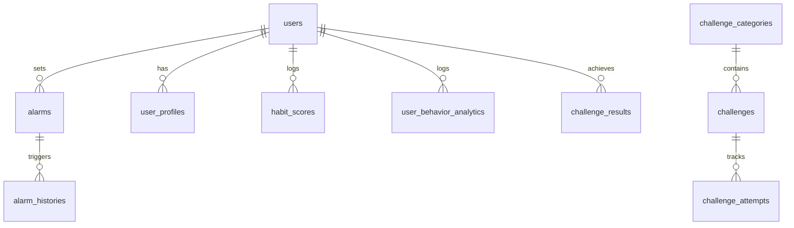

# Project Documentation

## 1. System Architecture Overview

The Intelligent Cognitive Alarm System is built with a modern web architecture decoupling the client interface from database logic.

* **Backend API (FastAPI):** Python web framework handling authentication, scheduling rules, engines, and reports. It exposes REST endpoints protected by JWT tokens.
* **Database (SQLAlchemy / SQLite / PostgreSQL):** SQLite is configured for local development and unit tests. Relational relationships handle cascading updates and deletes.
* **Adaptive Engines:**
  1. **Habit Scoring Service:** Aggregates a rolling average of consistency, sleep, challenge completions, and snooze delays to award a daily score (0-100).
  2. **Adaptive Difficulty Service:** Analyzes morning performance to dynamically scale challenge difficulties (Easy, Medium, Hard) to match user state.
  3. **Recommendation Engine:** Evaluates trends to push proactive lifestyle and sleep tips.

---

## 2. Database Models & Schema

### Core Entities:
* **User:** Tracks credentials, roles (`user`, `wellness_coach`, `admin`), and status.
* **UserProfile:** Holds user bio, timezone preference, and sleep goals.
* **Alarm:** Stores alarm time, repeat days, sound files, and smart adaptive switches.
* **UserBehaviorAnalytic:** Captures daily wake delays, snooze counts, sleep durations, and challenge completion metrics.
* **HabitScore:** Tracks scores across wake consistency, snooze reductions, and sleep schedule compliance.
* **Challenge:** Holds dynamic math, memory, pattern, or quiz questions.
* **ChallengeResult:** Summarizes accuracy and speed metrics for alarm-clearing attempts.
* **AlarmHistory:** Stores past alarm triggers.

---

## 3. Design Decisions & Trade-offs
* **SQLite for Local Dev:** Light database requiring zero external service setup. Can be instantly swapped to PostgreSQL in production.
* **In-Memory Slicing for Testing:** Static pool in-memory databases isolate test runs to avoid schema contamination and speed up CI/CD cycles.
* **ReportLab for PDF:** Renders PDFs programmatically in python memory space without spawning headless web engines, making it container-safe.
